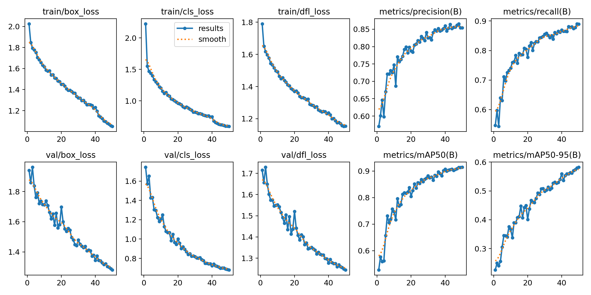

# Smart Parking Detection System

A computer vision-based application for detecting and monitoring parking slot occupancy using YOLOv8. The project automatically classifies parking slots as vacant or occupied and provides real-time statistics along with visual annotations.

## Features

- **Object Detection:** Powered by a pre-trained YOLOv8s model fine-tuned for parking lot detection.
- **Real-Time Interface:** An interactive web dashboard built with Streamlit.
- **Image Upload & Processing:** Upload parking lot images via the UI and automatically analyze slot occupancy.
- **Local Inference Support:** Tools are included to run inference locally using PyTorch and OpenCV.

## What Problem It Solves
Traditional parking management requires extensive hardware, sensors, and manual surveillance. This system uses AI to analyze standard camera feeds and automatically identify available slots. It reduces the time spent searching for parking, optimizes space utilization, and provides an efficient automated solution.

## Prerequisites

- Python 3.8 or higher.
- A locally embedded YOLO PyTorch model (`model_local/best.pt`) to run all inference tasks offline.

## Installation

1. **Clone the repository:**
   ```bash
   git clone <your-repo-url>
   cd smart-parking-detection
   ```

2. **Set up a virtual environment (optional but recommended):**
   ```bash
   python -m venv venv
   source venv/bin/activate  # On Windows use: venv\Scripts\activate
   ```

3. **Install the dependencies:**
   ```bash
   pip install -r requirements.txt
   ```

## Usage

### Streamlit Web Interface

To start the interactive Streamlit application:

```bash
streamlit run app.py
```

### Local Inference

If you possess a locally trained YOLO model (e.g., `best.pt`) and want to process images or videos locally without an internet connection, use the provided script:

```bash
python model_local/detect.py --model model_local/best.pt --source data/sample.mp4
```

### Available Flags for `detect.py`:

- **`--model`** *(Required)*: Path to your locally trained PyTorch model file (e.g., `model_local/best.pt`).
- **`--source`** *(Required)*: Path to the input image or video you want to analyze.
- **`--conf`**: Confidence threshold for YOLO predictions (default: `0.40`).
- **`--iou`**: Intersection over Union (IoU) overlap threshold for Non-Maximum Suppression (default: `0.30`).
- **`--imgsz`**: Image size for inference. Default is `1280`, which handles dense parking lots well.
- **`--skip-frames`**: Run inference every N frames to accelerate video processing (default: `5`).

**Example running with all flags:**
```bash
python model_local/detect.py --model model_local/best.pt --source data/sample.mp4 --conf 0.50 --iou 0.25 --imgsz 640 --skip-frames 3
```

## Dataset & Acknowledgements

The YOLOv8 model used in this application was trained on a dataset sourced from Roboflow Universe. All credits for compiling and annotating the original `parking-detection-ewm7h` dataset go to the Roboflow user **[model-version2](https://universe.roboflow.com/model-version2/parking-detection-ewm7h)**. The dataset is provided under the CC BY 4.0 license.
The dataset used for training is available in the `model_local/training_dataset/` directory.

## Training Metrics

Below are the performance metrics resulting from training the YOLOv8 model on the dataset:


